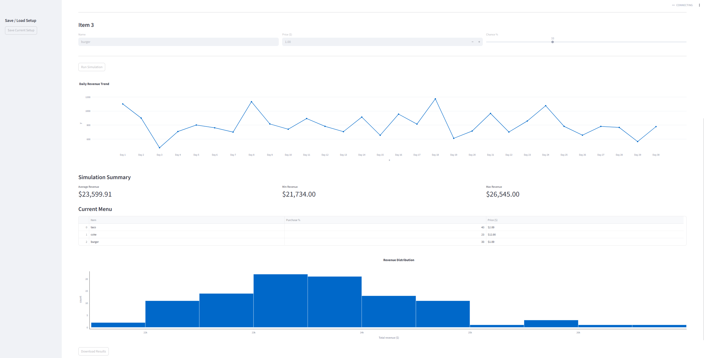

# Restaurant Revenue Simulator

An interactive data simulation app built with Python and Streamlit that models restaurant revenue using Monte Carlo methods and probability-based customer behaviour.

**LIVE DEMO: *
https://restaurant-revenue-simulator-dvrpqxazvqt2vb3bvkx2vv.streamlit.app/

---

## What it does

Restaurant owners and analysts often need to forecast revenue under uncertainty — how busy will we be? Which items will sell? This app simulates thousands of possible outcomes to give a realistic revenue distribution rather than a single guess.

- Build a custom menu with item names, prices, and purchase probabilities
- Set simulation parameters: days to run, average daily customers, number of Monte Carlo runs
- View a daily revenue trend for a single simulation run
- See the full Monte Carlo distribution across all runs
- Save your menu and settings to reuse later

## Demo



---

## How it works

Each simulation day works like this:

1. Customer count is randomized ±20% around the base value
2. Each customer independently rolls against each menu item's purchase probability
3. Items can be ordered multiple times per customer (via a secondary probability roll)
4. Revenue is calculated from units sold × price per item
5. This repeats across all days and all simulation runs

The Monte Carlo histogram shows the spread of total revenue outcomes — a wider distribution means higher uncertainty, a tighter one means more predictable revenue.

---

## Tech stack

| Tool | Purpose |
|------|---------|
| Python | Core simulation and probability logic |
| Streamlit | Interactive web interface |
| Plotly | Revenue trend and distribution charts |
| Pandas | Data formatting and CSV export |

---

## Run it locally

**Requirements:** Python 3.8+

```bash
# Clone the repo
git clone https://github.com/yourusername/restaurant-revenue-simulator
cd restaurant-revenue-simulator

# Install dependencies
pip install -r requirements.txt

# Run the app
streamlit run UI.py
```

---

## Project structure

```
restaurant-revenue-simulator/
+-- ui.py              # Streamlit UI and user interactions
+-- simulation.py       # Monte Carlo engine and probability logic
+-- requirements.txt    # Python dependencies
+-- README.md
```

---

## Skills demonstrated

- Monte Carlo simulation and probabilistic modelling
- Data visualisation (interactive charts with Plotly)
- Python application design (separation of UI and business logic)
- Statistical thinking — modelling uncertainty and distributions

---

*Built by Juan*
